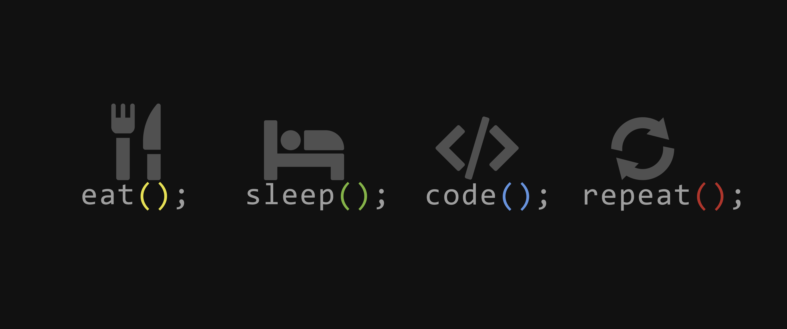

<h1 align="center">👋 Hello! I'm Ansu Sinha</h1>

<br>

<h3>How I'd define myself...literally</h3>

 ```ruby
 class Person
   def initialize
     @name = [ 'Ansu Sinha' ]
     @age = 18
     @education = [ 'Pursuing B.Tech CSE from SRM University, Chennai' ]
     @hobbies = [ 'Music', 'Basketball' ]
   end

   def current_location
     'New Delhi, India'
   end

   def next_locations
     ['Tech Industry']
   end

   def currently
     {
       studying: [ 'C', 'C++', 'Java' ],
       working on: [ 'App Development', 'Web Development' ]
      }
   end
 end
 ```
 
<br>

<h3 align="left">Languages and Tools:</h3>
<p align="left"> <a href="https://aws.amazon.com" target="_blank" rel="noreferrer">  </a> <a href="https://www.cprogramming.com/" target="_blank" rel="noreferrer">  </a> <a href="https://www.w3schools.com/cpp/" target="_blank" rel="noreferrer">  </a> <a href="https://www.w3schools.com/css/" target="_blank" rel="noreferrer">  </a> <a href="https://heroku.com" target="_blank" rel="noreferrer">  </a> <a href="https://www.w3.org/html/" target="_blank" rel="noreferrer">  </a> <a href="https://www.mysql.com/" target="_blank" rel="noreferrer">  </a> <a href="https://postman.com" target="_blank" rel="noreferrer">  </a> <a href="https://www.python.org" target="_blank" rel="noreferrer">  </a> </p>

<br>

### Quick stats about me
<p></p>

<p>&nbsp;</p>

<br>

<h3 align="left">Connect with me:</h3>
<p align="left">
<a href="https://linkedin.com/in/https://www.linkedin.com/in/ansu-sinha/" target="blank"></a>
<a href="https://stackoverflow.com/users/https://stackoverflow.com/users/16779642" target="blank"></a>
<a href="https://instagram.com/https://www.instagram.com/anshu.sinha_05/" target="blank"></a>
<a href="https://www.codechef.com/users/https://www.codechef.com/users/ansusinha05" target="blank"></a>
<a href="https://www.hackerrank.com/https://www.hackerrank.com/profile/ansu_sinha05" target="blank"></a>
<a href="https://codeforces.com/profile/https://codeforces.com/profile/ansu.sinha05" target="blank"></a>
<a href="https://www.leetcode.com/https://leetcode.com/ansu647/" target="blank"></a>
</p>

<br>

<h4 align="left">Note⚠️</h4>
<p align="left"> 
When I'm not coding you will find me taking photos or listening to music.
</p>
