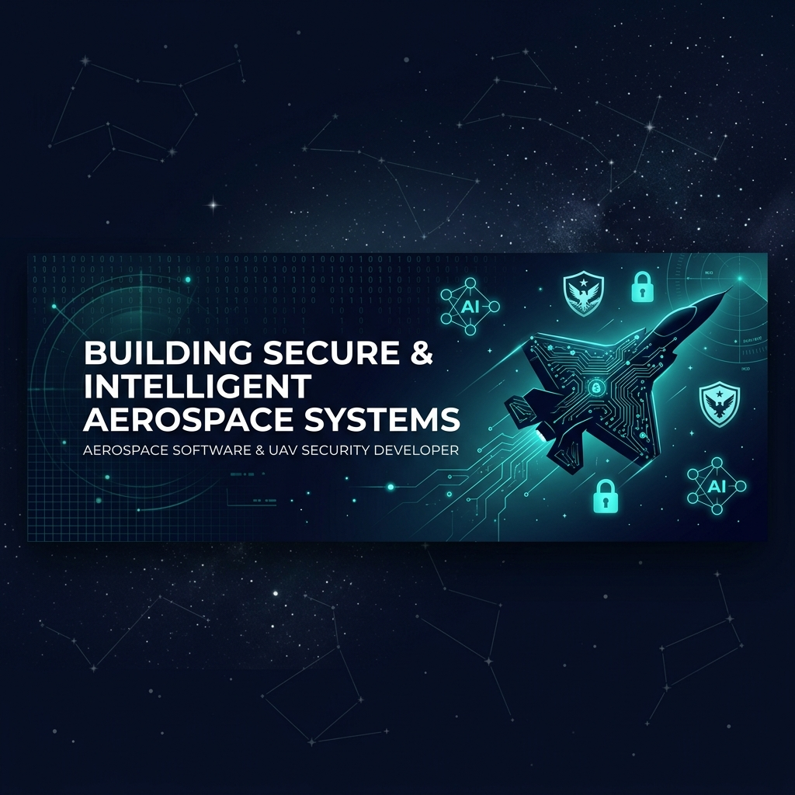

<!-- BANNER -->
<!-- 

<!-- TYPING SVG -->
<p align="center">
  <a href="https://git.io/typing-svg">
    
  </a>
</p> 

---

## 🧑‍💻 About Me

```yaml
name: Ansu Sinha
pronouns: He/Him

education:
  degree: B.Tech in Computer Science & Engineering
  university: SRM Institute of Science & Technology (SRMIST), Chennai
  year: Pre-Final Year

experience:
  - role: Defence Research Intern
    org: DRDO — Ministry of Defence, Govt. of India
    focus: Aerospace Software & Systems

domains:
  - Aerospace Software & Systems
  - UAV / Drone Security
  - AI/ML for Defence Applications
  - Cybersecurity & Threat Analysis

currently_building: Secure & Intelligent Aerospace Systems ✈️🔐
open_to: Internships | Research Collaborations | Hybrid/Remote Roles
```

---

## 🛠️ Tech Stack

### ✈️ Aerospace & Security


### 🤖 AI/ML & Data Science


### 💻 Languages & Frameworks


### ☁️ DevOps & Tools


---

## 🔭 What I'm Working On

- 🛩️ **Aerospace Systems** — Building secure software for UAV/drone platforms
- 🛡️ **Cybersecurity Research** — Threat analysis & vulnerability assessment for aerial systems
- 🧠 **AI/ML for Defence** — Predictive health monitoring & intelligent fault detection

---

## 🚀 Featured Projects

<table>
  <tr>
    <td width="50%">
      <h3 align="center">SPECTRA-UAV-PHM</h3>
      <p align="center">
        <a href="https://github.com/ansu647/SPECTRA-UAV-PHM" target="_blank">
          
        </a>
      </p>
      <p align="center"><strong>UAV Prognostics & Health Management</strong> — AI-driven predictive maintenance system for drone fleet operations. Combines signal processing with ML for real-time fault detection in aerospace systems.</p>
    </td>
    <td width="50%">
      <h3 align="center">Self-Pruning Network</h3>
      <p align="center">
        <a href="https://github.com/ansu647/self-pruning-network" target="_blank">
          
        </a>
      </p>
      <p align="center"><strong>Neural Network Optimization</strong> — Implementation of self-pruning mechanisms for efficient deep learning model compression. Reduces computational overhead while maintaining accuracy.</p>
    </td>
  </tr>
  <tr>
    <td width="50%">
      <h3 align="center">PulseDash</h3>
      <p align="center">
        <a href="https://github.com/ansu647/pulsedash" target="_blank">
          
        </a>
      </p>
      <p align="center"><strong>Real-time Monitoring Dashboard</strong> — A system health monitoring and analytics dashboard for tracking critical metrics and performance indicators.</p>
    </td>
    <td width="50%">
      <h3 align="center">Notification System</h3>
      <p align="center">
        <a href="https://github.com/ansu647/notification-system" target="_blank">
          
        </a>
      </p>
      <p align="center"><strong>Event-Driven Notification Engine</strong> — Scalable notification system architecture for delivering real-time alerts across multiple channels.</p>
    </td>
  </tr>
</table>

---

## 🤝 Connect With Me

<p align="center">
  <a href="https://linkedin.com/in/ansu-sinha" target="_blank">
    
  </a>
  <a href="mailto:ansu.sinha05@gmail.com">
    
  </a>
  <a href="https://github.com/ansu647" target="_blank">
    
  </a>
</p>

<p align="center">
  
</p>

---

<p align="center">
  <i>"Building the shield that protects the sky."🛡️✈️</i>
</p>
